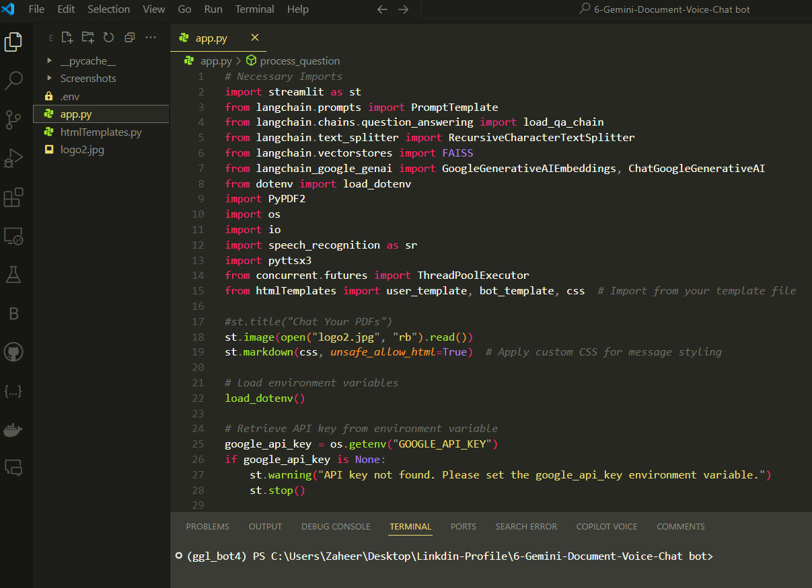
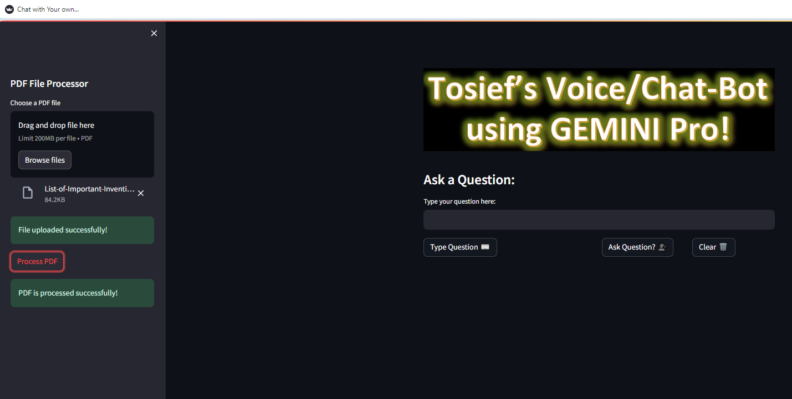
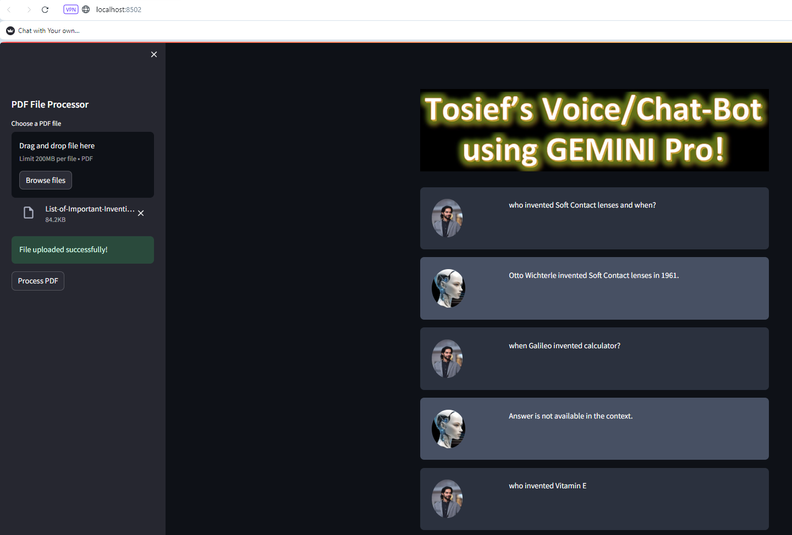

**🚀 Gemini-Document-Voice-Chatbot! 🚀**

**Introducing my latest contribution: a Question & Answer Voice/Chat-Bot built using Streamlit, LangChain, and Google Generative AI. This application allows users to explore PDFs and interactively let you query their content via text and voice inputs. It's designed to streamline information retrieval and make document interaction more intuitive and efficient.**

**🌟 Key Features:**

**📄 PDF Upload and Processing: Easily upload and process PDFs for querying.**

**🗣️ Voice and Text Interaction: Ask questions via voice or text and get detailed responses.**

**💬 Interactive Chat Interface: Enjoy a seamless conversation with dynamic message styling.**

**🌐 Powered by Google Generative AI: inspired by advanced AI models for accurate and context-aware answers.**

**🔍 Intelligent Search: Utilizes FAISS for efficient vector search, ensuring quick and relevant responses.**

## **01- Snapshot of the application's backend code in an IDE, showing the Python script responsible for PDF processing and API integration**
### **This image displays the backend code for the application in an Integrated Development Environment (IDE). The script, named `app.py`, includes essential imports for handling PDF files, speech recognition, and API interactions. The highlighted code section shows the setup for environment variables and the retrieval of the Google API key, crucial for the application's functionality.**

## **02- Initial interface of Tosief's Voice/Chat-Bot application using GEMINI Pro, featuring the PDF upload option**
### **This screenshot presents the initial interface of Tosief's Voice/Chat-Bot application powered by GEMINI Pro. The interface includes a PDF File Processor section on the left, where users can drag and drop PDF files or browse files for upload. The right side showcases the application's title and a text input field for users to ask questions, enhancing the interactive user experience.**

## **03- Updated interface of Tosief's Voice/Chat-Bot application, displaying processed questions and answers from the uploaded PDF**
### **In this image, the interface shows the PDF File Processor with a successfully uploaded and processed PDF. The right side of the interface displays the chat area where the user has asked questions about the content of the PDF, and the chatbot has provided answers. This demonstrates the application's capability to extract and respond to user queries based on the uploaded PDF content in real-time.**

